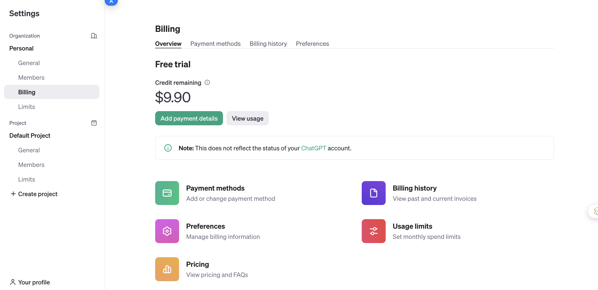
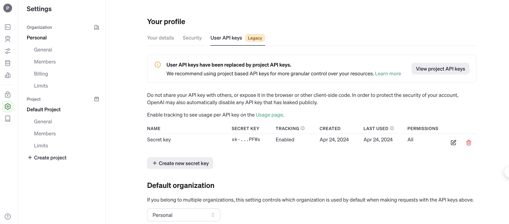
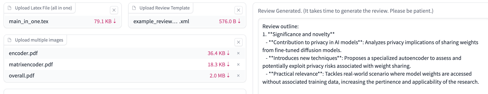

# GPT Reviewer
Welcome to GPT4Reviewer 0.1! This is an early version of the GPTReviewer and we are still at the early stage of exploring it. So please feel free to post issues and pull requests. If you want to get engaged in the development, feel free to contact [email](mailto:daxixi.jimmy@gamil.com).

This is a GPT-4 backend reviewer, which can automatically generate the review according to the given Latex file of the paper and an example review template. To start the reviewer server, install the Python packages according to requirements.txt
```
pip install -r requirements.txt
```
To use the feature of uploading the images in format of PDF, you need to install the proppler. On Linux you can use ```sudo apt-get install poppler-utils``` and on MacOS, you can use ```brew install poppler```.

Now, run the command
```
python main.py
```
We will have a server running on the local URL
```
http://0.0.0.0:7799
```
Open it in the browser.

## Upload the Latex File
We need to put all latex source code in one file such as main.tex and upload it.
## Upload the Review Template
The review template should be in the form of an XML file. Under the root, we need two components. The first one is the conference title and the second one is a complete review template. We have an example of the review template and you can refer to it to construct your review template or use the review template from the corresponding conferences/journals.
## Prepare the OpenAI key
Because our reviewer is based on GPT-4, you need OpenAI API and OpenAI membership to use it. So you need to first have an OpenAI membership and then log into your [OpenAI console](https://platform.openai.com/). Add your [billing details](https://platform.openai.com/settings/organization/billing/overview) 

so that you can use the API and then find and create your user key in your [console](https://platform.openai.com/).

Now you can just submit all these things to get your review 


## On-Going

- [ ] Better supporting figures.
- [ ] Support other LLMs and large models.
- [ ] Support uploading PDFs.